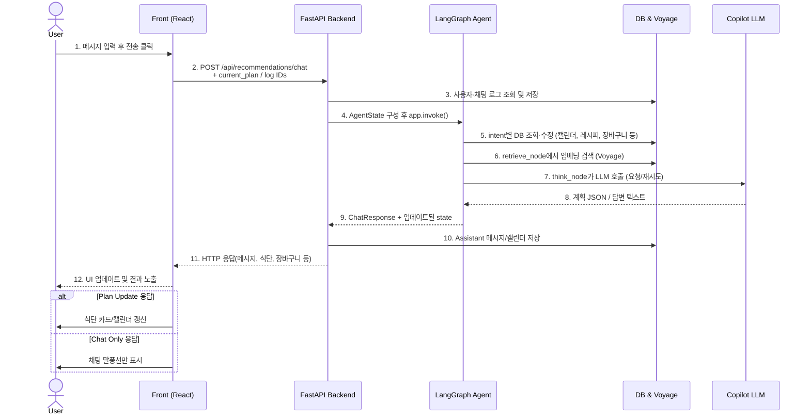

# Resiply 추천 에이전트 플로우

## 개요
- `backend/app/routers/recommendations.py`에 구현된 LangGraph 기반 에이전트는 사용자의 자연어 요청을 `router_node`에서 의도(Intent)로 분류한 뒤, 해당 기능 노드로 분기해 응답을 생성합니다.
- 상태 컨테이너(`AgentState`, [`backend/app/schemas/recommendations.py`](../backend/app/schemas/recommendations.py))가 모든 노드 간 공유 데이터(식단, 캘린더 정보, LLM 재시도 횟수 등)를 운반합니다.
- 추천(식단 수정) 흐름은 `retrieve_node → think_node`로 이어지며, `think_node`는 최대 3회까지 재시도 후 실패 시 사과 메시지로 종료합니다.

## AgentState 핵심 필드
| 구분 | 필드 | 설명 |
| --- | --- | --- |
| 입력 | `user_message` | 최신 사용자 발화 |
|  | `current_plan` | 화면에 표시 중인 `DailyPlanResponse` 목록 |
|  | `db_session`, `member_id` | 데이터베이스 세션 및 사용자 식별자 |
| 컨트롤 | `intent` | `router_node`가 채우는 `IntentAnalysis` 결과 |
|  | `calendar_date`, `calendar_range`, `delete_meals` | 캘린더 조회/삭제용 파라미터 |
|  | `plan_delete_*` | 현재 추천안 수정 시 삭제할 일차/끼니 지정 값 |
|  | `retrieved_recipes` | 검색 노드가 수집한 후보 레시피 |
|  | `retry_count` | `think_node` 재시도 횟수 (기본 0) |
| 출력 | `final_response` | 각 노드가 채우는 최종 `ChatResponse` |

## 노드별 역할 요약
- **router_node**: 사용자 발화를 규칙+LLM으로 분석해 `IntentAnalysis`를 생성하고, 필요 시 캘린더/삭제 파라미터를 추출합니다.
- **cart_node / checkout_node**: 현재 플랜을 기반으로 장바구니 담기/결제 안내 응답을 생성합니다.
- **show_plan_node**: 메모리 상의 최신 식단표 재출력.
- **show_calendar_node / show_calendar_range_node**: 캘린더에 저장된 식단을 특정 날짜 혹은 기간 단위로 재구성해 `plan_update` 응답을 반환합니다.
- **calendar_delete_node / plan_delete_node**: 각각 캘린더 저장분, 현재 추천안에 대한 삭제 요청을 처리합니다.
- **ask_plan_details_node**: 식단 생성에 필요한 일수/끼니 정보가 부족할 때 추가 질문을 반환합니다.
- **calendar_register_node**: 현재 추천안을 DB 캘린더에 저장하고, 충돌 시 사용자 확인을 요청합니다.
- **simple_chat_node**: 일반 대화 모드를 비동기 LLM 호출로 처리합니다.
- **retrieve_node**: Voyage 임베딩/랜덤 조회로 레시피 후보를 수집해 `retrieved_recipes`를 채웁니다.
- **think_node**: 후보 + 현재 플랜을 바탕으로 LLM에게 새 식단 생성을 요구하고, 유효하면 `plan_update` 응답을 작성합니다. 실패 시 `retry_count`를 올리고 스스로 재호출됩니다.

## LangGraph 플로우차트
```mermaid
flowchart TD
    A([Chat Request]) --> B[router_node\n의도 분류]
    B -->|cart_add| C[cart_node]
    B -->|checkout| D[checkout_node]
    B -->|show_plan| E[show_plan_node]
    B -->|show_calendar| F[show_calendar_node]
    B -->|show_calendar_range| G[show_calendar_range_node]
    B -->|calendar_delete| H[calendar_delete_node]
    B -->|plan_delete| I[plan_delete_node]
    B -->|ask_plan_details| J[ask_plan_details_node]
    B -->|calendar_register| K[calendar_register_node]
    B -->|chat| L[simple_chat_node]
    B -->|modify| M[retrieve_node\n(레시피 검색)]
    M --> N[think_node\n(식단 생성)]
    N -->|성공| O[[END]]
    N -->|오류 및 재시도 (<4회)| N
    C --> O
    D --> O
    E --> O
    F --> O
    G --> O
    H --> O
    I --> O
    J --> O
    K --> O
    L --> O
```

## 처리 순서 요약
1. `/api/recommendations/chat` 엔드포인트는 사용자 메시지를 저장하고 LangGraph `app.invoke()`에 `AgentState`를 전달합니다.
2. `router_node`가 의도와 부가 파라미터를 결정하고 `route_decision`이 다음 노드를 선택합니다.
3. 대부분의 노드는 즉시 `final_response`를 작성하고 종료 엣지로 이동합니다.
4. `modify` 의도만 `retrieve_node → think_node` 경로로 이동하며, `think_node`는 재시도 조건부 엣지를 통해 자체 루프를 가집니다.
5. 성공 시 `final_response`에 포함된 `ChatResponse`가 FastAPI 응답 본문으로 직렬화되어 프론트엔드로 전달됩니다.

## 사용자↔프론트↔백엔드↔AI 워크플로우
- 아래 플로우는 사용자가 메시지를 입력한 순간부터 화면에 결과가 다시 표시될 때까지의 단계를 세로 수직선 구조(사용자·Front·Back·AI/데이터 계층)로 요약한 것입니다.
- 실제 UI에서는 메시지 전송, 로딩 상태, 결과 렌더링이 순차적으로 일어나며, 백엔드는 LangGraph 실행 동안 DB와 외부 LLM·임베딩 서비스를 호출합니다.


